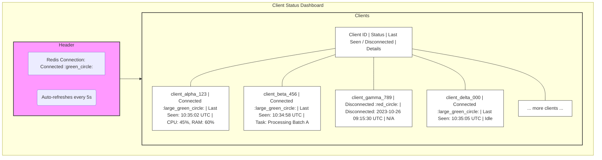

# Welcome to Collegium Serpentis! :snake:

Collegium Serpentis is a powerful yet easy-to-use system that helps you keep track of multiple clients and their statuses in real-time. Think of it as a friendly digital registrar that always knows who's connected and what they're up to! It's built using modern tools like FastAPI for the server and WebSockets for instant updates.

## :sparkles: Cool Features

*   **Real-Time Updates**: See client registrations and status changes as they happen.
*   **WebSocket Magic**: Smooth and fast communication between server and clients.
*   **Speedy In-Memory Storage**: Uses Redis (when you're running it) to keep track of client statuses lightning fast.
*   **Modern Python Backend**: Built with asynchronous Python for great performance.

## :project_diagram: System Architecture

Here's a look at how the different parts of Collegium Serpentis fit together:

```mermaid
graph TD;
    subgraph Clients
        C1[Client 1]
        C2[Client 2]
        C3[Client N]
    end

    subgraph FastAPI_Server [FastAPI Server]
        WS[/ws WebSocket Endpoint]
        API[HTTP Endpoints e.g., /docs, /]
        AppLogic[Application Logic]
    end

    subgraph Data_Store
        Redis[(Redis)]
    end

    C1 -->|Connect via WebSocket| WS;
    C2 -->|Connect via WebSocket| WS;
    C3 -->|Connect via WebSocket| WS;

    WS -->|Client Registration/Status Updates| AppLogic;
    AppLogic -->|Write Client Status| Redis;
    AppLogic -->|Read Client Status| Redis;
    
    AppLogic -->|Broadcasts Status (implicitly via WebSockets)| C1;
    AppLogic -->|Broadcasts Status (implicitly via WebSockets)| C2;
    AppLogic -->|Broadcasts Status (implicitly via WebSockets)| C3;

    %% Styling for clarity (optional, but can help)
    classDef client fill:#lightgrey,stroke:#333,stroke-width:2px;
    classDef server fill:#lightblue,stroke:#333,stroke-width:2px;
    classDef datastore fill:#moccasin,stroke:#333,stroke-width:2px;

    class C1,C2,C3 client;
    class FastAPI_Server server;
    class Redis datastore;
```

## :hammer_and_wrench: What You'll Need (Prerequisites)

Before you get started, make sure you have these tools installed:

*   **Python**: Version 3.13.2 (This project uses some of the newer Python features!)
*   **Poetry**: A friendly tool for managing project dependencies. (Think of it as a smart shopping list for your project's code needs).
*   **Redis Server**: Recommended for the full experience, especially in a production-like setup. (This is our super-fast in-memory data store).
*   **Docker**: (Optional, but highly recommended!) Makes running the server and Redis a breeze.

## :rocket: Getting Started: Installation

Ready to get Collegium Serpentis running? Here's how:

1.  **Clone the Repository**: Get your own copy of the project.
    ```bash
    git clone https://github.com/yourusername/collegium_serpentis.git
    cd collegium_serpentis
    ```

2.  **Install Dependencies with Poetry**: This command tells Poetry to grab all the necessary Python packages for the project.
    ```bash
    poetry install --no-root
    ```

3.  **(Optional) Install Developer Tools**: If you plan to contribute or want to run tests, get the development dependencies too.
    ```bash
    poetry install --with dev --no-root
    ```

4.  **(Optional but Recommended) Local Virtual Environment**: Tell Poetry to keep your project's Python environment neatly inside the project folder.
    ```bash
    poetry config virtualenvs.in-project true
    ```

5.  **Set Up Pre-Commit Hooks**: These are little helpers that check your code for style and quality *before* you commit it. Super handy!
    ```bash
    poetry run pre-commit install
    ```

6.  **Install Redis Tools**: Useful command-line tools for interacting with Redis (if you're using it directly).
    ```bash
    sudo apt install redis-tools
    ```

## :computer: Using Collegium Serpentis

### Option 1: Running with Docker Compose (Recommended & Easiest!)

Docker Compose helps you start both the FastAPI server and the Redis database with a single command. It's like an orchestra conductor for your application services!

1.  **Build and Start**: This command builds the necessary Docker images (if they don't exist) and starts the services.
    ```bash
    docker compose up --build
    ```
    *   Your server will be humming along at `http://localhost:8000`.
    *   Redis will be ready for action at `localhost:6379`.

2.  **Stop the Services**: When you're done, this command gracefully stops everything.
    ```bash
    docker compose down
    ```

### Option 2: Running the Server Manually

If you prefer to run the server directly (without Docker for the server itself):

1.  **Start the Redis Server (Using Docker)**: It's still easiest to run Redis in Docker.
    ```bash
    docker run --rm --name redis-server -p 6379:6379 redis
    ```
    *   **Test Redis**: You can check if Redis is happy by sending it a `ping`.
        ```bash
        redis-cli ping
        ```
        You should see `PONG` in reply!

2.  **Start the FastAPI Server**: 
    ```bash
    poetry run uvicorn src.server.server:app --reload
    ```
    *   This starts the server at `http://localhost:8000`.
    *   The `--reload` flag means the server will automatically restart if you make changes to the code – very useful for development!

#### Managing Your Manual Redis Container:
*   **Stopping Redis**: `docker stop redis-server`
*   **Removing Redis (once stopped)**: `docker rm redis-server`

## :busts_in_silhouette: Running Clients

Once you have the server running, you can connect clients to test the system and see real-time status updates in action!

### Option 1: Running a Client with Poetry (Manual)

If you want to run a client directly using Poetry:

1.  **Make sure the server is running** (using either Docker Compose or manual setup from above).

2.  **Run the client**:
    ```bash
    poetry run python src/client/client.py
    ```

This will start a client that connects to the WebSocket server at `ws://localhost:8000/ws`. The client will:
*   Register itself with a unique ID
*   Send periodic status updates
*   Handle reconnection automatically if the connection is lost

### Option 2: Running Clients with Docker

You can also run clients in Docker containers for easier management and testing with multiple clients:

1.  **Build the client Docker image** (if not already built):
    ```bash
    docker build -f Dockerfile.client -t collegium-client .
    ```

2.  **Run a single client**:
    ```bash
    docker run --rm --network host collegium-client
    ```

3.  **Run multiple clients** (great for testing!):
    ```bash
    # Run 3 clients in the background
    for i in {1..3}; do
        docker run --rm --network host --name "client-$i" -d collegium-client
    done
    ```

4.  **Stop all running client containers**:
    ```bash
    docker stop $(docker ps -q --filter ancestor=collegium-client)
    ```

**Note**: The `--network host` flag allows the Docker client to connect to the server running on your localhost. On Windows/Mac, you might need to use `host.docker.internal:8000` instead of `localhost:8000` in the client configuration.

### Watching Clients in Action

Once you have clients running, you can:

*   **Watch the Dashboard**: Open `http://localhost:8000/` to see all connected clients and their real-time status updates.
*   **Check Server Logs**: The server will show connection events and status updates in its console output.
*   **Monitor Client Logs**: Each client will show its connection status and the messages it's sending to the server.

### :mag: API Documentation

Once your server is running, you get interactive API documentation for free! Open your web browser and go to:

*   **Swagger UI (Interactive)**: `http://localhost:8000/docs` (Lets you try out the API endpoints directly!)
*   **ReDoc (Alternative View)**: `http://localhost:8000/redoc`

### :left_right_arrow: WebSocket Endpoint

Clients connect to the server using WebSockets at this address:

```
ws://localhost:8000/ws
```

## :bar_chart: Client Status Dashboard

Here's a conceptual mockup of the Client Status Dashboard:



Want to see who's connected? There's a handy web page for that!

Once the server is running (e.g., via `docker-compose up` or manually), open your browser and navigate to:

[http://localhost:8000/](http://localhost:8000/)

**The dashboard shows you:**

*   Whether the Redis server is connected.
*   A list of all clients:
    *   Their unique ID.
    *   Connection Status (Connected :green_circle: / Disconnected :red_circle:).
    *   Last Seen time (for those online) or Disconnect Time (for those offline).
    *   Any other status details the clients might send.
*   The dashboard refreshes automatically every 5 seconds, so you always have the latest info!

## :desktop_computer: Redis Web Interface (Redis Commander)

Want to peek inside Redis and see what's really happening with your data? Redis Commander gives you a beautiful web interface to explore your Redis database!

### :rocket: Quick Setup

1. **Install Redis Commander globally** (one-time setup):
   ```bash
   npm install -g redis-commander
   ```

2. **Start Redis Commander**:
   ```bash
   redis-commander
   ```

3. **Access the Web Interface**: Open your browser and go to:
   ```
   http://localhost:8081
   ```

### :eyes: What You Can Explore

Once Redis Commander is running, you can browse and inspect:

*   **Client Status Data**: Look for keys like `client_status:*` to see all registered clients and their current status information.

*   **Chat Messages**: Browse the chat system data:
    *   **`chat_global`**: Stream containing broadcast messages sent to all clients
    *   **`chat_stream:{client_id}`**: Individual client message streams for direct messages
    *   **Message History**: Click on any stream to see the full message history with timestamps

*   **System Keys**: Explore other Redis data structures used by the system for client management and status tracking.

*   **Real-Time Monitoring**: Watch as new data appears in real-time as clients connect, send messages, and update their status.

### :gear: Advanced Usage

*   **Custom Port**: If port 8081 is busy, start on a different port:
    ```bash
    redis-commander --port 8082
    ```

*   **Read-Only Mode**: For safe exploration without accidentally modifying data:
    ```bash
    redis-commander --read-only
    ```

*   **Connection Details**: By default, Redis Commander connects to `localhost:6379`. If your Redis is elsewhere:
    ```bash
    redis-commander --redis-host your-host --redis-port your-port
    ```

### :mag_right: Pro Tips

*   **Stream Inspection**: Click on any chat stream key to see the message history - perfect for debugging chat functionality
*   **Key Patterns**: Use the search/filter features to find specific client data or message streams
*   **Live Updates**: Keep the interface open while testing - you'll see new keys and data appear in real-time
*   **Message Debugging**: Great for troubleshooting why messages aren't being delivered or checking message format

This tool is invaluable for understanding how your client registrations, status updates, and chat messages flow through the Redis backend!

## :sleuth_or_spy: Testing Your Setup

We use `pytest` to make sure everything is working as expected.

*   **Run All Tests**: This command runs all the tests and gives you a coverage report (telling you how much of your code is tested).
    ```bash
    poetry run pytest -s -vvv --cov-report term-missing --cov=src tests/
    ```
*   **Run a Specific Test**: If you only want to run one test (for example, one you're working on).
    ```bash
    # Example: Replace with the actual path to your test function
    poetry run pytest -s -vvv --cov-report term-missing tests/server/test_server.py::TestWebSocketServer::test_websocket_connection
    ```

## :seedling: Developing

Here are some tools and practices used:
*   **Testing**: `pytest` is our go-to for writing and running tests.
*   **Code Formatting**: We use `black` to keep our Python code neat and consistent.
*   **Linting**: `ruff` helps us catch common code issues and maintain quality with blazing fast performance.

### Pre-Commit Hooks

Remember those pre-commit hooks we installed? They run `black` and `ruff` automatically before you make a commit. This helps keep the codebase clean.

*   **Run Manually (If Needed)**: If you want to run all the pre-commit checks on all files at any time:
    ```bash
    poetry run pre-commit run --all-files
    ```

### Manual Code Quality Checks

You can also run the tools manually:

*   **Format code with Black**:
    ```bash
    poetry run black src/ tests/
    ```

*   **Lint and check with Ruff**:
    ```bash
    poetry run ruff check src/ tests/
    ```

*   **Auto-fix linting issues with Ruff**:
    ```bash
    poetry run ruff check --fix src/ tests/
    ```

*   **Format code with Ruff** (alternative to Black):
    ```bash
    poetry run ruff format src/ tests/
    ```

## :scroll: License

Collegium Serpentis is released under the **MIT License**. You can find the full license text in the `LICENSE` file (though it seems one isn't in the root directory currently - a good thing to add!).

---

We hope this guide helps you get started with Collegium Serpentis. If you have any questions or ideas, feel free to open an issue or discussion!
